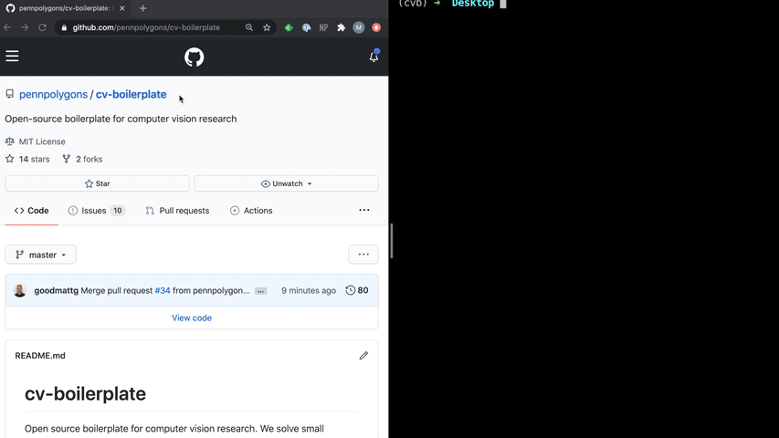

# cv-boilerplate



Open source boilerplate for computer vision research. We solve small problems related to project management, experiment management, code styling, and model training so you can get back to research!


# Installation

## Standard

```
git clone https://github.com/pennpolygons/cv-boilerplate.git
cd cv-boilerplate
make init
```

## Anaconda

```
git clone https://github.com/pennpolygons/cv-boilerplate.git
cd cv-boilerplate
make init-conda
```

# Demo

```
python research/train.py 
```

- Visdom (in browser): __localhost:8000__
- Output log file, images, data files, hydra logs, Visdom logs: `\outputs` 


# Building Blocks & Choices

This project is a collection of principled choices to make CV research easier. We prioritize using tools that minimize researcher engineering work, help keep the codebase _uncluttered_, and make research easy to distribute and reproduce.

- __Python Formatting__: [Black](https://black.readthedocs.io/en/stable/)
- __Configuration Management__: [Hydra](https://hydra.cc/)
- __Machine Learning Framework__: [PyTorch](https://pytorch.org/)
- __Training / Evaluation Managment__: [PyTorch Ignite](https://pytorch.org/ignite/)
- __Visualization__: [Visdom](https://github.com/facebookresearch/visdom)
- __Typed Code__: [Types!](https://docs.python.org/3/library/typing.html)
- __Version Control__: Git